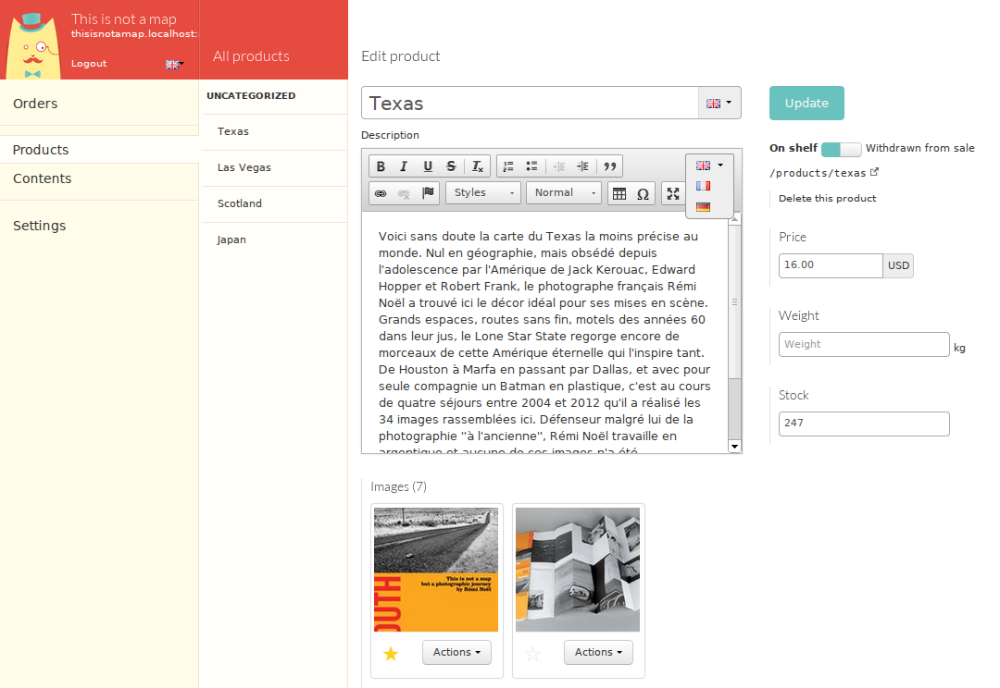
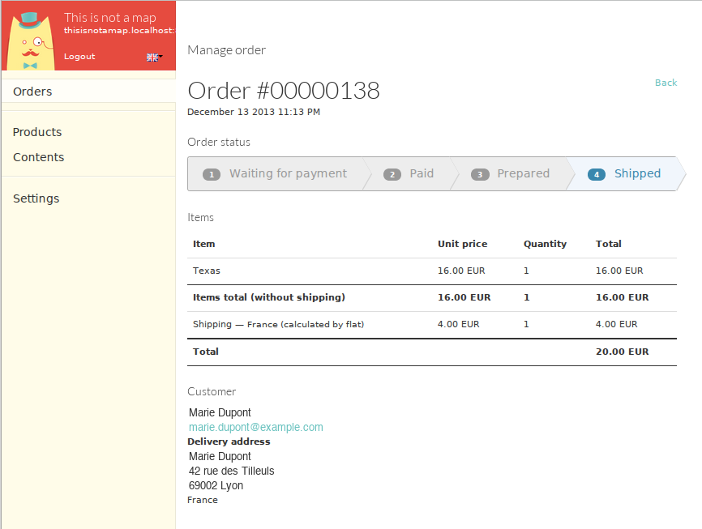
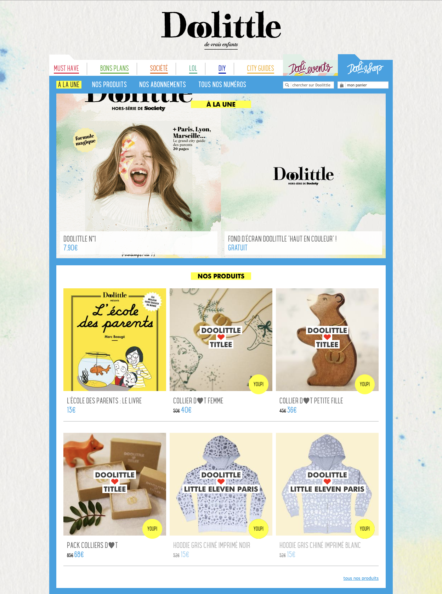
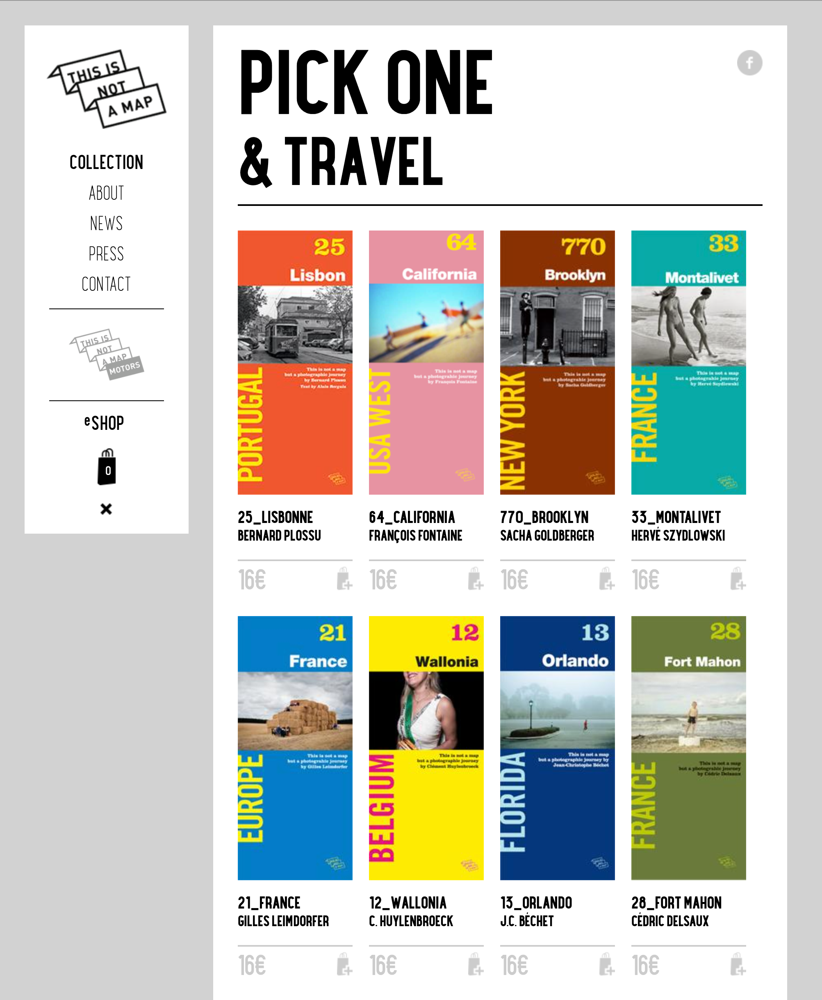

# Mayocat Shop

Open source e-commerce and marketplace platform on the JVM.

> **Note:** This project is retired as of 2017. It is no longer actively developed, though production sites still run on it. The repository remains as a reference.

## Motivation

Running an online store or a multi-vendor marketplace shouldn't require a monolithic CMS or assembling a dozen services. Mayocat Shop is a self-contained platform that one person can deploy easily and a non-technical merchant can operate.

It ships as a single JAR that can be pointed at a PostgreSQL database with a theme dropped in to get a store running — back-office, storefront, and REST API included.

## Features

E-commerce platform with content management and multi-vendor marketplace support:

- **Run one store or many** — multi-tenancy is built in. Each storefront gets its own catalog, configuration, theme, and data from a single deployment.
- **Sell things** — products with variants, collections, cart, checkout, payment (PayPal and extensible), shipping (flat rate, weight-based, price-based), taxes, orders, invoicing.
- **Manage content** — pages, blog, home page curation. The CMS is a first-class citizen next to the catalog.
- **Customize without coding** — theme system with HTML templates and a declarative addon system. Need a color picker on your products? Declare it in your theme config, it shows up in the back-office.
- **Integrate** — REST API for every entity, webhooks for order and payment events, Elasticsearch-powered search.
- **Localize** — multi-language product content, locale-aware configuration.

## Screenshots

Product editing with rich text, image gallery, and inventory management:



Order management with status tracking, line items, and shipping:



A few storefronts built on the platform — each with its own theme, branding, and content:

<table>
<tr>
<td width="33%"><br><strong>Doolittle</strong> — children's magazine and shop</td>
<td width="33%"><br><strong>This is not a map</strong> — travel photography books</td>
<td width="33%"><br><strong>Aristide</strong> — cat hotel in Paris, with booking, blog, and content pages</td>
</tr>
</table>

## Design choices

A few things that shaped the architecture:

**Platform and domain are separate.** A reusable platform layer (accounts, configuration, theming, search, storage, multi-tenancy) and the e-commerce domain (catalog, cart, checkout, payment, shipping) don't know about each other. The platform could host a different application entirely.

**Multi-tenancy is structural.** Not a filter on queries — it goes through the configuration system (which merges defaults, theme settings, and per-tenant overrides), request handling (tenant resolution from hostname or path), and data access. A marketplace operator sets global defaults; each tenant customizes from there.

**Extensibility through declaration.** Theme authors define custom fields — selects, checkboxes, color pickers, dates — in YAML. The platform renders them in the back-office, stores them, indexes them. No plugins to write.

**Lightweight by choice.** Dropwizard and XWiki's component manager instead of heavier frameworks. Fast to start, easy to follow, explicit module boundaries.

## Project structure

```
mayocat-shop/
├── platform/        Reusable infrastructure (27 modules)
│   accounts, multitenancy, configuration, store,
│   search, themes, addons, webhooks, rest,
│   image, mail, pdf, localization, ...
│
├── shop/            E-commerce domain (14 modules)
│   catalog, cart, checkout, payment, billing,
│   customer, shipping, taxes, marketplace, ...
│
└── cms/             Content management (4 modules)
    pages, news, contact, home
```

Built with Java, Dropwizard, PostgreSQL, Elasticsearch, and AngularJS — about 50,000 lines of Java across 40+ modules, developed over 2012–2017 in roughly 1,700 commits.

Licensed under [MPL 2.0](http://mozilla.org/MPL/2.0/).

## Contributors

- **Jérôme Velociter** — author and primary developer
- **Louis Béziau** — back-office UX design
- **Johann Pardanaud** — back-office localization system, bug fixes
- **Vincent Velociter** — date handling patches
